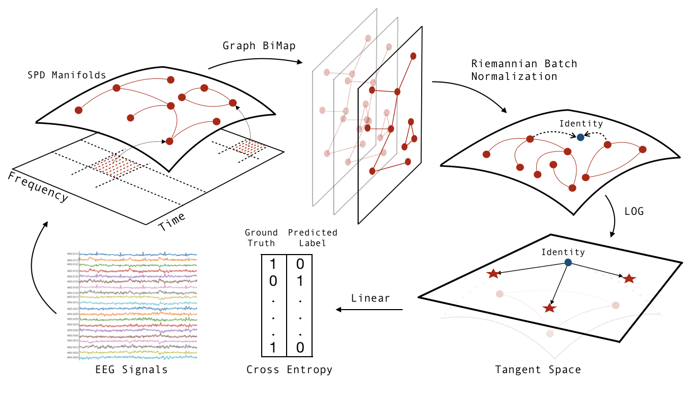

This repo contains the Python implementation of two classifiers, Tensor-CSPNet and Graph-CSPNet, for motor imagery-electroencephalography (MI-EEG) classification. We would like to call this novel path the **geometric method**, because we hope to keep it alive by involving and sowing the seeds of more techniques and perspectives from differential geometry, information geometry, Riemannian optimization, geometric statistics, geometric control theory, manifold learning, geometric deep learning, etc. 

# Tensor-CSPNet and Graph-CSPNet

## Introduction

The mainstream of an effective MI-EEG classifier will exploit information from the time, spatial, and frequency domains. For spatial information, they both use BiMap-structure as the BiMap transformation in the CSP methods. For temporal and frequency information, their architectures vary in two approaches. Tensor-CSPNet uses CNNs for capturing the temporal dynamics, while Graph-CSPNet uses graph-based techniques for capturing information behind the time-frequency domains. In the following table, we have a detailed comparision of two methods. 

| Geometric Methods     | Tensor-CSPNet       |Graph-CSPNet   |
| ---------------------- | ------------- | ------------- |
| 1.Network Input:          | Tensorized Spatial Covariance Matrices         | Time-frequency Graph  |
| 2.Architecture:           | (Mixed) Geometric Deep Learning:         | Geometric Deep Learning:  |
|                        | BiMaps; CNNs                           | Graph-BiMaps |
| 3.Optimizer:             | Riemannian Adaptive Optimization     | Riemannian Adaptive Optimization|
|4.Underlying Space:|SPD Manifolds| SPD Manifolds|
|5.Heritage:|Common Spatial Patterns|Common Spatial Patterns; Riemannian-based Approaches|
|6.Principle:|The Time-Space-Frequency Principle: Exploitation in the frequency, space, and time domains sequentially.|The Time-Space-Frequency Principle: Exploitation in the time-frequency domain simultaneously, and then in the space domain.|
|7.Mechanism:|Trainable-parameter CNNs for temporal dynamics|Preset graph weights in spectral clustering for time-frequency distributions|

### Tensor-CSPNet

[</img>](https://ieeexplore.ieee.org/document/9805775)
[</img>](https://arxiv.org/abs/2202.02472)

Tensor-CSPNet is the first geometric deep learning approach for the motor imagery-electroencephalography classification. It exploits the patterns from the time, spatial, and frequency domains sequentially. 

If you want to cite Tensor-CSPNet, please kindly add this bibtex entry in references and cite. 
        
        @ARTICLE{9805775,
            author={Ju, Ce and Guan, Cuntai},
            journal={IEEE Transactions on Neural Networks and Learning Systems}, 
            title={Tensor-CSPNet: A Novel Geometric Deep Learning Framework for Motor Imagery Classification}, 
            year={2022},
            volume={},
            number={},
            pages={1-15},
            doi={10.1109/TNNLS.2022.3172108}
          }
          
### Graph-CSPNet

Graph-CSPNet uses graph-based techniques to simultaneously characterize the EEG signals in both the time and frequency domains. It exploits the time-frequency domain simultaneously, and then in the space domain. 

    If you want to cite Graph-CSPNet, please kindly add this bibtex entry in references and cite. 
    
        @article{ju2022deep,
                title={Graph Neural Networks on SPD Manifolds for Motor Imagery Classification: A Perspective from the Time-Frequency Analysis},
                author={Ju, Ce and Guan, Cuntai},
                journal={arXiv preprint arXiv:2211.02641},
                year={2022}
               }

### Timeline of Related Works

#### Before 2020

Tensor-CSPNet and Graph-CSPNet are deep learning-based classifiers on the second-order statistics of EEGs. In contrast to first-order statistics, using these second-order statistics is the classical treatment in MI-EEG classification, and the discriminative information contained in these second-order statistics is adequate for classification. Based on Riemannian geometry-based perspective in BCIs for the past ten years, developed by Alexandre Barachant, Marco Congedo, Christian Jutten, Florian Yger, etc., Tensor-CSPNet and Graph-CSPNet use modern second-order neural networks on SPD manifolds developed by Zhiwu Huang, Luc Van Gool, Daniel Brooks, Olivier Schwander, Frederic Barbaresco, etc. The geometric method probabily starts a novel technology generation of the widely-used common spatial pattern method in BCIs during the deep learning age. Great thanks to all of the poineers for their great contributions in developing the fundamental tools and contributing perspectives for this path. 

#### 2020
1. C. Ju, D. Gao, R. Mane, B. Tan, Y. Liu and C. Guan, "Federated Transfer Learning for EEG Signal Classification," 2020 42nd Annual International Conference of the IEEE Engineering in Medicine & Biology Society, 2020, pp. 3040-3045, doi: 10.1109/EMBC44109.2020.9175344. (**EMBC2020**)
#### 2022
1. C. Ju and C. Guan, “Tensor-cspnet: A novel geometric deep learning framework for motor imagery classification,” IEEE Transactions on Neural Networks and Learning Systems, 2022, pp. 1–15, doi: 10.1109/TNNLS.2022.3172108.(**TNNLS2022**)
2. C. Ju and C. Guan, “Deep optimal transport for domain adaptation on spd manifolds,” arXiv preprint arXiv:2201.05745, 2022, submitted.
3. R. J. Kobler, J.-i. Hirayama, and M. Kawanabe, “Controlling the fréchet variance improves batch normalization on the symmetric positive definite manifold,” in ICASSP 2022-2022 IEEE International Conference on Acoustics, Speech and Signal Processing. IEEE, 2022, pp. 3863–3867. (**ICASSP2022**)
4. R. J. Kobler, J.-i. Hirayama, Q. Zhao, and M. Kawanabe, "SPD domain-specific batch normalization to crack interpretable unsupervised domain adaptation in EEG," accepted by **NeurIPS2022**. 
5. Y.-T.Pan, J.-L.Chou, and C.-S.Wei, “Matt:Amanifoldattentionnetwork for eeg decoding,” accpeted by **NeurIPS2022**.
6. ...

### Related Repositories

The coding style in this repo is relatively rough. We welcome anyone to refactor it to make it more effective. We list the repositories of related python packages as follows: [</img>](https://fbcsptoolbox.github.io/), [</img>](https://github.com/ravikiran-mane/FBCNet), [</img>](https://github.com/pyRiemann/pyRiemann), [</img>](https://github.com/zhiwu-huang/SPDNet), [</img>](https://gitlab.lip6.fr/schwander/torchspdnet), and [</img>](https://github.com/geoopt/geoopt). Another implementation of SPD manifold-valued neural networks refers to Kobler's TSMNet [</img>](https://github.com/rkobler/TSMNet). 

## Usages

The models are provided under `/utils/model` inside there we have Tensor-CSPNet and Graph-CSPNet. The modules of the two models can be found in `/utils/modules`. There are two scenarios, i.e., cross-validation and holdout, in the experiments. We put two training files of Graph-CSPNet for scenarios on BCIC dataset. Please build and put your downloaded data into the folder `/dataset/`, take the training file from the folder out, and then train and test your model. You need also build the folder `/model_paras/` and `/results/` to keep model/optimizer parameters and results, respectively.

Keep in mind that with the given network architecture and training parameters in the folder, Tensor-CSPNet and Graph-CSPNet achieve around 76% on the CV scenario and around 72% on the holdout scenario on the BCIC-IV-2a dataset, and around 73% on the CV scenario and around 69% on the holdout scenario on the KU dataset using my local computer. And, the reported results are the best that I achieve after several runs. It is normal to have a bit of randomness in each run because of many computational issues. The classification performance of Tensor-CSPNet and Graph-CSPNet is near optimal on the given scenarios. For better performance, please try more hyperparamerter combinations, network architecutre, and training strategies in each run.

Both Tensor-CSPNet and Graph-CSPNet use matrix backpropagation for updating weights in each layer, which runs a little slower in each epoch than that of typical one, but 50 epochs in total in a run probably yields relatively good performance. For other MI-BCI datasets, it is suggested to try a novel segmentation plan that characterizes the region of interest associated with the task. Please modify the related classes in `/utils/load_data`. There are several tips in training probably helpful (or not) to follow:
Tip 1. Set the initial learning rate = 1e-3;
Tip 2. Pick a not so big batch size for training;
Tip 3. The epoch of each run should at least 50 in either scenario. So, don't use the early stopping before 50 epoch;
Tip 4. For the CV scenario, I sometimes to ban the validation process in order to increase the number of trials for training. 

There are two kinds of optimizers that we provide in this folder. One is called Class MixOptimizer given in `/utils/functional`; The other is from the python package geoopt. In my implementation, we found the best classification performance is initialized parameters from the BiMap layer with nn.Parameter and parameters from Riemannian Batch Normalization with geoopt. This might not always be a useful hand-on experience for other tasks. 

### Data Availability

The KU dataset (a.k.a., the OpenBMI dataset) can be downloaded in the following link:
[**GIGADB**](http://gigadb.org/dataset/100542)
with the dataset discription [**EEG dataset and OpenBMI toolbox for three BCI paradigms: an investigation into BCI illiteracy**](https://academic.oup.com/gigascience/article/8/5/giz002/5304369); The BCIC-IV-2a dataset can be downloaded in the following link:
[**BNCI-Horizon-2020**](http://bnci-horizon-2020.eu/database/data-sets)
with the dataset discription [**BCI Competition 2008 – Graz data set A**](https://www.bbci.de/competition/iv/desc_2a.pdf) and the introduction to [**the BCI competition**](https://www.bbci.de/competition/iv/).

### License and Attribution

Copyright 2022 S-Lab. All rights reserved.

Please refer to the LICENSE file for the licensing of our code.

